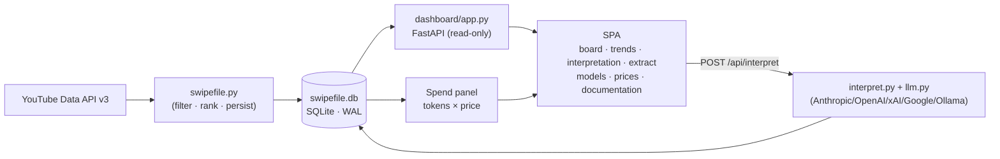
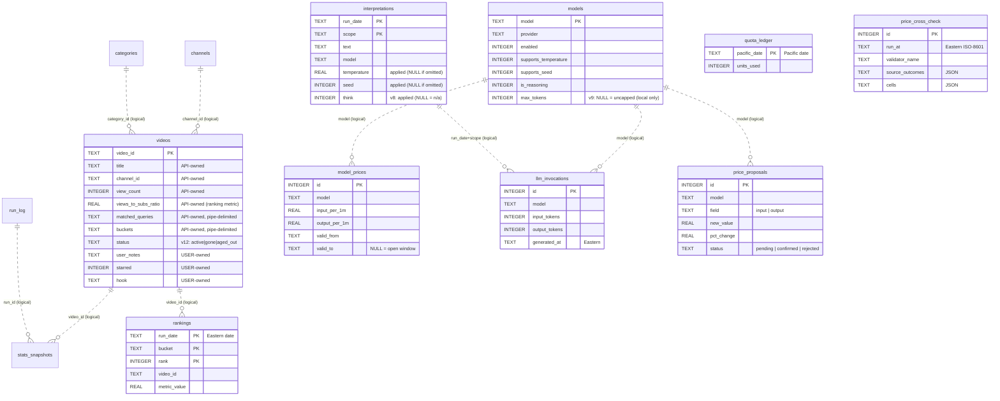
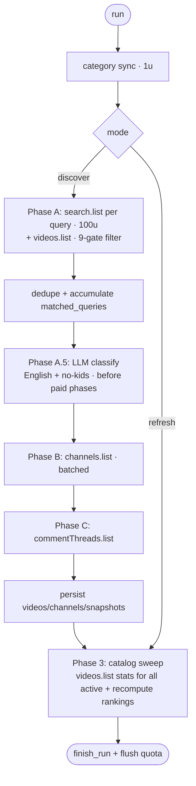

# daily-intel - Technical Guide

A single onboarding + support reference for the daily-intel system. It has two
halves:

- **Reference** (sections 2–5) - *how does it work?* Data model, YouTube API, the
  LLM/spend layer, and a code map.
- **Support runbook** (sections 6–10) - *how do I run, operate, and fix it?* Setup,
  configuration & secrets, operations, troubleshooting, and the load-bearing
  invariants.

For deeper background see the sibling docs this guide links to rather than
restates: `../CLAUDE.md` (data-safety rules), `../context.MD` (project/brand),
`../README.md` (quick start), and the plan docs (`dashboard-plan.MD`,
`model-price-plan.MD`, `interpretations-generator-plan.MD`,
`price-refresh-agent-plan.MD`). The current schema is **v12**. Code is referenced
by **symbol name** (`file.py · function`) in the refreshed sections; some older
`file:line` references remain and, along with file line-counts, are being
regenerated in a deferred precise-line pass once the in-flight v12
catalog-lifecycle work settles.

---

## 1. Overview & orientation

daily-intel is a YouTube Shorts discovery-and-ranking pipeline plus a mostly
read-only dashboard. A CLI pipeline (`swipefile.py`) searches the YouTube Data API
for short-form habit/health videos, filters and ranks them, applies an LLM
English/no-kids classify gate, and writes everything to a single SQLite file
(`data/database/swipefile.db`, WAL mode). A FastAPI dashboard (`dashboard/app.py`)
reads that file and serves a single-page app with **seven** pages - **board**,
**trends**, **interpretation**, **extract** (run the pipeline via a streamed
terminal), **models** (a model/price registry editor), **prices** (the
price-refresh agent's proposals + cross-check), and **documentation** (a
filesystem docs browser). An LLM layer (`interpret.py` + `llm.py`, five providers)
summarizes each ranked lane into a few sentences, logs every call's tokens, and a
spend panel prices those calls from a per-model price table. A separate
**price-refresh agent** (`price_refresh/`) keeps that price table current by
scraping provider pricing pages, cross-checking against third-party feeds, and
staging large moves for one-click human approval.



> **Data safety first.** `swipefile.db` holds hand-entered, irreplaceable columns
> (notes, stars, hooks). It runs in WAL mode, so **never** back it up with a bare
> `cp` of the `.db` file. See `../CLAUDE.md` and section 8.

---

## 2. The data model

The schema is defined once in `SCHEMA_STATEMENTS` (`db.py`) and applied by
`init_db`. Connections are opened by `get_connection` with `PRAGMA
journal_mode=WAL` and a `sqlite3.Row` factory (the dashboard passes
`check_same_thread=False` for its threadpool-served sync endpoints; each
connection is still confined to one request).

> **No enforced foreign keys.** `get_connection` sets `PRAGMA foreign_keys=ON`,
> but **no table declares a `FOREIGN KEY` constraint** - so the relationships
> below are *logical / by-convention*. Every join in the code is a `LEFT JOIN`
> tolerant of a missing parent (e.g. a `rankings` row whose `video_id` has no
> `videos` row). Treat the ER diagram as data-flow, not referential integrity.



### Table reference

| Table | PK | Purpose | Written by |
|-------|----|---------|-----------|
| `videos` | `video_id` | Core video metadata, stats, derived metrics, **and** user annotations | Pipeline (API cols) + dashboard (user cols) |
| `channels` | `channel_id` | Channel stats, refreshed each discover | Pipeline |
| `stats_snapshots` | `id` (autoinc); `UNIQUE(run_id, video_id)` | Per-run engagement snapshot for trend charts | Pipeline |
| `rankings` | `(run_date, bucket, rank)` | The ranked leaderboard per lane per run - dashboard's main read source | Pipeline |
| `run_log` | `run_id` | One row per pipeline run (mode, status, quota) | Pipeline |
| `quota_ledger` | `pacific_date` | Cumulative daily YouTube quota units | Pipeline |
| `categories` | `category_id` | YouTube category id→title for the region | Pipeline |
| `interpretations` | `(run_date, scope)` | The current LLM summary per lane (one row, replaced on re-run) | LLM layer |
| `llm_invocations` | `id` (autoinc) | Append-only log of every LLM call (tokens, params, duration) - drives spend | LLM layer |
| `app_preferences` | `key` | Key-value store of remembered UI choices | Dashboard |
| `models` | `model` | LLM registry: capability flags (`supports_temperature`, `supports_seed`, `is_reasoning`, `max_tokens`) + dropdown visibility | `seed_models.py`, `/models` editor |
| `model_prices` | `id` (autoinc) | Effective-dated per-model prices for cost accounting | `seed_models.py`, `/models` editor, price-refresh agent |
| `price_proposals` | `id` (autoinc) | Staged price moves (>10%) awaiting one-click human confirm/reject; ≤1 pending per `(model, field)` via the `ux_pending_proposal` partial index | Price-refresh agent (`price_refresh/`) + `/prices` editor |
| `price_cross_check` | `id` (autoinc) | Append-only provenance log, one row per price-refresh run: which validator answered, per-URL fetch outcomes, per-model/field cross-check cells (all JSON) | Price-refresh agent |

Full column lists live in `db.py` (`SCHEMA_STATEMENTS`). A few columns carry
semantics worth calling out:

- **`videos.matched_queries` / `videos.buckets` / `videos.tags` /
  `videos.topic_categories` / `videos.top_comments`** - pipe-delimited TEXT
  (`|`), parsed in Python, not relational.
- **`videos.views_to_subs_ratio`** - the primary ranking metric.
- **`videos.is_short`** - derived from `duration_seconds <= SHORT_MAX_SECONDS`.
- **`videos.status`** (v12) - `active` | `gone` | `aged_out`, with
  `status_changed_at` and `last_view_growth_at`. The catalog sweep snapshots only
  `active` rows. (Retirement transitions are still being wired - see section 8.)
- **`rankings.metric_value`** - the `views_to_subs_ratio` captured at rank time.
- **`interpretations.temperature` / `seed` / `think`** - the **applied** run
  controls (v7/v8); `NULL` when the provider/model did not apply that control.
- **`llm_invocations.filter`** - forward-compat, always `NULL` today.
- **`model_prices.valid_to`** - `NULL` means the current open window;
  `deleted` is a soft-delete flag (spend prices history regardless of it).

### Load-bearing invariants (data)

1. **API-owned vs user-owned columns on `videos`.** `VIDEO_API_COLUMNS`
   (`db.py:333-340`) are written on every upsert; `VIDEO_USER_COLUMNS`
   (`db.py:343-345` - `user_notes, starred, starred_at, hook, first_10_sec,
   saves`) are **never** named in an UPDATE, so a pipeline refresh cannot clobber
   them. The dashboard writes only user columns. Neither side touches the other's.
2. **Eastern `run_date` vs Pacific `pacific_date`.** `rankings`,
   `interpretations`, and `llm_invocations` key on **Eastern** `run_date`;
   `quota_ledger` keys on **Pacific** `pacific_date` (Google's quota resets at
   midnight Pacific). **Never join or equate them.** The one conversion lives in
   `config.pacific_date()` (`config.py:325-337`).
3. **All stored timestamps are Eastern ISO-8601 with offset** via
   `config.now_local_iso()` (`config.py:317-322`), e.g.
   `2026-06-07T14:30:00-04:00`. Never UTC, never naive. The single exemption is
   the YouTube `publishedAfter` request param (`get_published_after()`, UTC/Z).
4. **Schema versioning** is stamped in `PRAGMA user_version` (current
   `SCHEMA_VERSION = 12`, `db.py`). Additive tables use `CREATE TABLE IF NOT
   EXISTS` (idempotent, autocommitted). Column-adding migrations (v5
   `llm_invocations.duration_ms`; v7 `interpretations.temperature`/`seed`; v8
   `interpretations.think`; v9 `models.max_tokens`; v12 `videos.status` +
   `status_changed_at` + `last_view_growth_at`) and the offline model seed all run
   inside one explicit `BEGIN…COMMIT` so the schema and the version stamp move
   atomically - the stamp is written **last**. See section 11 for the full version
   history (v1–v12).

---

## 3. YouTube API implementation

All API code is in `swipefile.py`. The client is built by `build_youtube_client`:
`build("youtube", "v3", developerKey=api_key)`.

### The five API calls

| Call | Function (`swipefile.py`) | `part` / key params | Quota |
|------|----------|---------------------|-------|
| `search.list` | `search_videos` | `q`, `type=video`, `videoDuration=short`, `publishedAfter=get_published_after()`, `order=viewCount`, `maxResults=RESULTS_PER_QUERY` (50), `part=snippet`, `relevanceLanguage=SEARCH_RELEVANCE_LANGUAGE`, optional `publishedBefore=PUBLISHED_BEFORE` | **100** |
| `videos.list` | `fetch_video_details` | `id` (comma-joined), `part=snippet,statistics,contentDetails,status,topicDetails` | 1 |
| `channels.list` | `fetch_channel_details` | batched by `CHANNEL_BATCH_SIZE` (50); `part=snippet,statistics,brandingSettings` | 1 |
| `videoCategories.list` | `fetch_video_categories` | `part=snippet`, `regionCode=CATEGORY_REGION` | 1 |
| `commentThreads.list` | `fetch_top_comments` | `videoId`, `maxResults=COMMENTS_PER_VIDEO` (10), `order=relevance`, `textFormat=plainText` | 1 |

**The `search.list` filter set is load-bearing** - it is the first, cheapest place
the niche is scoped, so each parameter is deliberate:

- `type=video` + `videoDuration=short` - only Shorts (≤ ~3 min as YouTube counts
  it; a second, exact duration gate runs post-fetch, see below).
- `publishedAfter=get_published_after()` - a rolling `now − WINDOW_DAYS` cutoff
  (the **only** UTC/`Z` timestamp in the system; everything stored is Eastern).
  `publishedBefore` is passed only if the optional `PUBLISHED_BEFORE` is set.
- `order=viewCount` - most-viewed first, so the 50-result page skims the top.
- `maxResults=RESULTS_PER_QUERY` (50) - the API per-page max; one page per query.
- `part=snippet` - search returns only ids + snippet; full stats/duration/status
  come from the follow-up `videos.list`.
- `relevanceLanguage=SEARCH_RELEVANCE_LANGUAGE` (`"en"`) - biases relevance to
  English. Note `search.list` deliberately passes **no `regionCode`** (relevance
  is steered by `relevanceLanguage` instead); `regionCode` is used only by
  `videoCategories.list` for category titles.

`videos.list` is where the real filterable fields arrive - its `part` list maps to:
`snippet` (title, `categoryId`, `defaultAudioLanguage`), `statistics` (`viewCount`,
`likeCount`, `commentCount`), `contentDetails` (`duration`, `definition`),
`status` (`madeForKids`, `selfDeclaredMadeForKids`), `topicDetails`
(`topicCategories`). Quota cost constants (`SEARCH_QUOTA_COST=100`, the rest `=1`)
live in `config.py`.

### Post-processing - the filter gates

`_classify_video` (`swipefile.py`) is the single source of truth for acceptance.
It returns the name of the **first** gate that rejects a video, or `"kept"`. Order
matters, and every field is read defensively (`.get()`) so a **missing field fails
closed** (excluded, never crashes, never passes unchecked). There are **nine**
gates, in this order:

1. `window` - `within_window(publishedAt, cutoff_dt)`; same horizon ranking uses.
2. `made_for_kids` - `status.madeForKids` **or** `status.selfDeclaredMadeForKids`
   is true → dropped (either flag rejects).
3. `kid_keyword` - `title_has_kid_keyword(title, KID_TITLE_KEYWORDS)`: the title
   contains a curated kid/parenting keyword (e.g. *baby, toddler, nursery, for
   kids*) as a whole word, case-insensitive. A deterministic, free reject that runs
   **before** the paid LLM classify lane so obvious kid content never spends an LLM
   call. The list is `KID_TITLE_KEYWORDS` (settings-tunable); whole-word matching
   means `kid` never fires inside `kidney`.
4. `category` - `snippet.categoryId` not in `BLOCKED_CATEGORY_IDS = {"1","10","24"}`.
5. `language` - `defaultAudioLanguage` is blank **or** starts with `en` (a present non-`en` value is dropped).
6. `missing_duration` - `contentDetails.duration` present (else can't derive `is_short`).
7. `missing_views` - `statistics.viewCount` present (else can't confirm threshold).
8. `duration` - `parse_duration(...) <= SHORT_MAX_SECONDS` (180).
9. `views` - `viewCount >= MIN_VIEWS`.

`filter_videos` is a thin loop over `_classify_video` that tallies drops by
first-rejecting gate; its `drops` dict has one key per gate above (`window`,
`views`, `duration`, `category`, `language`, `made_for_kids`, `kid_keyword`,
`missing_duration`, `missing_views`), and `sum(drops.values()) == len(videos) −
len(kept)` (each video counted **once**, under its first failing gate). Read-only
**tuning diagnostics** sit alongside (`qualifying_view_counts`,
`language_drop_values`, `untagged_audio_language_count` - the language **blind
spot**, blank-language videos pass the gate - and `views_below_min`); they never
perturb the drop counts.

### English + no-kids LLM classification (Phase A.5)

The keyword and `made_for_kids` gates above catch the *obvious* cases; a second,
**LLM** pass catches what the YouTube API cannot express - content that is
non-English despite an `en`/blank tag, or kid-targeted/kid-subject without a
give-away title. It runs as **Phase A.5**: after dedupe but **before** the
channel/comment phases, so a video the classifier rejects never incurs their
quota. It is gated by `CLASSIFICATION_ENABLED` (default on).

- **Models.** A primary (`CLASSIFICATION_MODEL`, default
  `google:gemini-2.5-flash-lite`) and a **different-provider** fallback
  (`CLASSIFICATION_FALLBACK_MODEL`, default `anthropic:claude-haiku-4-5`); the pair
  is validated by `validate_classifier_pair` (the two providers must differ, so a
  primary-provider throttle has somewhere to fail over). A preflight probes each
  provider once; per video the phase tries the primary with bounded retries, then
  the fallback.
- **Pure core, bound seam.** The decision logic lives in `classify.py`
  (`classify_video` → a `Verdict`; `ClassificationError` on unparseable output) and
  is **DB- and network-free**; `swipefile.py` binds the real `llm.generate` + the
  `llm_invocations` logging around it. Each call is logged under the scope
  `video_classification`, so its cost (including any reasoning-token spend on the
  fallback) flows into the spend panel (section 4).
- **Spend breaker.** If the run falls back more than `max_fallback_videos`
  (`CLASSIFICATION_RETRY`) times - the signal that the primary provider is durably
  throttled - the phase **aborts and persists what it has**, pruning the kept set
  to only classified survivors. That maps to exit `EXIT_CLASSIFY_BUDGET` and run
  status `classify_budget_exceeded` (section 8). A fail-closed default: a video
  whose every attempt errors is dropped, never kept unchecked.
- **Determinism caveat.** Temperature is 0 and a fixed `CLASSIFY_SEED` is sent, but
  this only stabilizes the gemini primary; the reasoning fallback is not
  reproducible. Do not treat classify output as deterministic across runs.

### Derived data, dedup, ranking

- Derived per video: `views_to_subs_ratio`, `views_per_day`, `is_short`, and the
  pipe-delimited `matched_queries` / `buckets` / `tags` / `topic_categories` /
  `top_comments`.
- **Dedup** (`dedupe_videos`) keeps the first occurrence of a `video_id` and
  accumulates every query that matched it into `matched_queries`.
- **Ranking** sorts each bucket by `rank_sort_key` =
  `(-views_to_subs_ratio, -view_count, video_id)` and keeps the top `TOP_N` (20)
  into `rankings`.

### Quota accounting

`QuotaBudget` (`swipefile.py`) tracks the day: `baseline` (units already
spent today, Pacific), `cap = DAILY_QUOTA_LIMIT - SAFETY_BUFFER`, `run_units`,
`flushed_units`. `api_call_with_retry` checks `can_afford` **before** each call (a
proactive guard), then handles errors (see section 9). The expensive 100-unit
`search.list` charge is **flushed eagerly** to `quota_ledger` in its own committed
transaction so a crash can't lose it (`add_quota_units`, `db.py`); cheaper calls
are flushed once at run end (the unflushed remainder).

A pre-flight guard estimates discover cost (`estimate_discover_units`; heuristics
`ESTIMATED_CHANNEL_CALLS`, `ESTIMATED_COMMENT_CALLS`) and, if it won't fit the cap,
either **downgrades** to refresh (no flag) or **hard-stops** (explicit
`--discover`). The catalog sweep's cost (one `videos.list` per 50-video batch) is
sized from `count_eligible_for_refresh` so the estimate and the actual batch agree.

### Discover vs refresh flow



Tunables that shape discovery (all in `settings.toml` unless noted): `MIN_VIEWS`,
`WINDOW_DAYS`, `SHORT_MAX_SECONDS`, `SEARCH_RELEVANCE_LANGUAGE`, `CATEGORY_REGION`,
`DAILY_QUOTA_LIMIT`, `SAFETY_BUFFER`, `TOP_N`, `SEARCH_QUERIES`,
`REFRESH_MAX_AGE_DAYS` (catalog-sweep retirement horizon, section 8), and the
classify-lane knobs `KID_TITLE_KEYWORDS`, `CLASSIFICATION_ENABLED`,
`CLASSIFICATION_MODEL`, `CLASSIFICATION_FALLBACK_MODEL`, `CLASSIFICATION_RETRY`.
`RESULTS_PER_QUERY` (50) is a hardcoded constant in `config.py`, **not** a
settings.toml knob. See section 7.

---

## 4. Interpretations, LLM calls, and spend

The interpretation generator turns a ranked lane into a 3–4 sentence summary. The
core is `interpret.py`; the provider seam is `llm.py`; the dashboard exposes it at
`POST /api/interpret`.

### Providers & models

Five providers (`SUPPORTED_PROVIDERS` in `llm.py`): `anthropic`, `openai`, `xai`,
`google`, `ollama` (local). Models are identified everywhere by the canonical
**`provider:model`** string, split at exactly one point - `split_model()`. The
baseline registry and its capability flags are seeded from `config.SEED_MODELS`:

| Model | `temp` | `seed` | `reasoning` | Notes |
|-------|:---:|:---:|:---:|-------|
| `anthropic:claude-haiku-4-5` | 1 | 0 | 0 | Messages API has no seed (structural) |
| `openai:gpt-5.4-nano` | 0 | 1 | 1 | reasoning model - rejects non-default temperature |
| `xai:grok-4.3` | 1 | 1 | 1 | live-corrected by `seed_models.py` post-migrate |
| `google:gemini-2.5-flash-lite` | 1 | 1 | 0 | the classify-lane primary |
| `ollama:qwen3.5:9b` | 1 | 1 | 1 | **local** thinking model; honors `think`; `max_tokens` NULL (uncapped) |

`is_reasoning` records that a model *can* reason (informational + gates the per-run
`think` toggle); `max_tokens` is the per-model output cap (v9), `NULL` only for
local providers (`config.default_max_tokens` supplies a reasoning-aware default for
cloud models so thinking tokens never starve the answer).

### Input - prompt construction

`build_prompt()` (`interpret.py:153-185`) renders the lane's ranked rows. `rank`
and `title` anchor each line; everything else is a **selectable per-video field**.
The field spec `PROMPT_FIELDS` (`interpret.py:118-129`) is the single source of
truth driving the dashboard multi-select, request validation, and rendering. Each
field is a renderer that reads one column and omits a `NULL` (never prints the
literal "None"). The default set (`DEFAULT_PROMPT_FIELDS`, `interpret.py:134`) is
all fields **except** `top_comments`. `normalize_fields()` (`interpret.py:140-150`)
sanitizes any requested list down to known keys in canonical order. The selection
is persisted server-side in `app_preferences` under `PROMPT_FIELDS_PREF`.

Scopes (`interpret.py:33`): `SCOPES = ("overall",) + sorted(VALID_BUCKETS)` →
`overall`, `habit`, `health`.

### Output - `GenerateResult`

`generate()` (`llm.py`) splits the model and normalizes the per-run controls in
**one** place before dispatching to a provider adapter, gating each on the model's
capability flags so an adapter never receives a parameter the model cannot apply:

- **seed** - a non-positive seed → `None` (xAI rejects `seed <= 0`); a model
  without `supports_seed` drops it (Anthropic also drops it structurally).
- **think** - the per-run reasoning toggle, forwarded **only** when the model
  `is_reasoning` **and** its provider honors think (`THINK_PROVIDERS`, i.e.
  `ollama`); otherwise normalized to `None`. A genuine `False` (Ollama, toggled
  off) survives - it persists `0`, not `NULL`.
- **temperature** - applied only if `supports_temperature` (ranges enforced in the
  adapter: Anthropic 0–1, the others 0–2).
- **max_tokens** - the per-model output cap; `None` means uncapped and the adapter
  omits its cap parameter (local models). This replaces the old single
  `MAX_OUTPUT_TOKENS` constant.

The normalized `GenerateResult` is identical in shape across providers: `text`,
`input_tokens`, `output_tokens`, `seed_applied` (the seed that actually governed,
or `None`), plus the think fields `thinking` (reasoning content, for display) and
`think_applied` (the applied 0/1 toggle, for persistence) - both `None` for the
four cloud adapters, populated only by a `THINK_PROVIDERS` adapter.

Per-provider token-usage field mapping:

| Provider | input tokens | output tokens | text |
|----------|--------------|---------------|------|
| Anthropic | `usage.input_tokens` | `usage.output_tokens` | `content[].text` |
| OpenAI / xAI | `usage.prompt_tokens` | `usage.completion_tokens` | `choices[0].message.content` |
| Google | `usage_metadata.prompt_token_count` | `usage_metadata.candidates_token_count` | `resp.text` |

### Write path

`synthesize_lane()` (`interpret.py:188-245`): fetch the lane (empty → skip, no LLM
call); read the model's capability flags via `db.fetch_model` (unregistered →
`LLMError`); build the prompt; time the **network** call with `time.monotonic()`;
then in **one** transaction, in pinned order, `log_invocation()` (append to
`llm_invocations`) followed by `upsert_interpretation()` (replace the
`(run_date, scope)` row). The whole write is wrapped in `run_with_db_retry`. The
pinned order matters: the newest `llm_invocations.id` always matches the stored
text, which is how `fetch_interpretation` (`db.py:707-730`) attributes
`duration_ms` to the displayed summary.

### Dashboard endpoints (LLM)

- `POST /api/interpret` (`app.py:429-470`) - body `InterpretRequest`
  (`run_date, scope, model, temperature, seed?, fields?`). Validates the model is
  in the allowed set (422), persists the field selection, then synthesizes. Any
  `LLMError` becomes a clean **400** (never a 500). Empty lane → `{skipped: true}`.
- `GET /api/interpret-defaults` (`app.py:473-513`) - prepopulates the controls:
  the dropdown models, a per-model `capabilities` map (so the UI greys controls a
  model ignores), the last-used `model/temperature/seed` (`fetch_latest_invocation`,
  MAX(id)), and the available + selected prompt fields.
- `GET /api/interpretation` (`app.py:143-170`) - the stored summary for a lane;
  absent text renders a clean empty state (200, empty string), never an error.

### Spend calculation

`fetch_spend()` (`db.py:952-1009`) produces one row per model: summed input/output
tokens, invocation count, summed **cost**, and `unpriced_invocations`. Cost is
priced **per invocation** by `LEFT JOIN`-ing `model_prices` on the half-open date
window:

```sql
SUM( COALESCE(i.input_tokens,0)  / 1000000.0 * p.input_per_1m
   + COALESCE(i.output_tokens,0) / 1000000.0 * p.output_per_1m )  AS cost
...
LEFT JOIN model_prices p
       ON p.model = i.model
      AND p.valid_from <= substr(i.generated_at, 1, 10)
      AND (p.valid_to IS NULL OR substr(i.generated_at, 1, 10) < p.valid_to)
```

The same half-open predicate is used by `fetch_effective_price` (`db.py:774-794`);
a predicate-agreement test guards the two against drift. An invocation no window
covers gets a `NULL` price term (excluded from cost, counted in
`unpriced_invocations`).

`/api/spend` (`app.py:558-589`) returns **two** breakdowns with deliberately
different time keys - do not collapse them:

- `run` - filtered by `run_date` (the pipeline run summarized).
- `month_to_date` - filtered by `substr(generated_at,1,7)`, the Eastern calendar
  month the spend was incurred.

`_price_models()` (`app.py:516-555`) shapes the display: `cost_per_million` =
`cost / (in+out) * 1e6` (the efficiency key), `share_pct` = `cost / total` (donut
slice). Palette/thresholds come from `config.SPEND_VIZ`.

### Price maintenance

Prices live in `model_prices` as non-overlapping, effective-dated windows. On a
fresh migration, `db._seed_models()` (`db.py:223-264`) seeds one open window per
model from `config.DEFAULT_PRICES` (`config.py:49-54`). New prices go through
`insert_price_window()` (`db.py:891-914`), which **auto-closes every open window
for that model** (deleted or not) at the new `valid_from`, then inserts the new
open window - this is what preserves the non-overlap invariant (see section 10). Windows
and models are soft-deleted (`set_price_deleted`, `set_model_deleted`); **spend
ignores the deleted flag** (it prices history against whatever window covered the
date), while the dropdown honors it.

The operator script `seed_models.py` (run **after** `db.init_db`) live-verifies
the xAI model string: it lists xAI's `/v1/models`, picks the cheapest suitable
grok (`pick_grok_model`), runs one real generation to confirm (`verify_xai_live`),
then reconciles the registry (`correct_xai`); it also cross-checks the Anthropic
string against the invocation log (`verify_anthropic`).

A full model/price **admin UI** is served under `/api/models*` and `/api/prices*`
(`dashboard/app.py`): list/insert/update/soft-delete/restore models, add/soft-delete
price windows, and invocation-count warnings before a delete.

### The price-refresh agent (`price_refresh/`)

Keeping `model_prices` current is automated by a separate package, structured as
pure layers around a single DB seam:

- **`extract.py`** - a **fetch-then-extract** seam (no tool-use, DB- and
  network-free at import). `fetch_page` GETs a provider's pricing page (httpx, a
  browser `user_agent` to dodge 403s) → text; `extract_source` prompts the LLM
  (`extract_prices` over `config.PRICE_SOURCES`, the extraction model is
  `EXTRACTION_MODEL`, persisted/overridable via `app_preferences`) for strict cited
  JSON of per-1M rates; `parse_extraction` defensively parses + structure-checks it.
- **`validators.py`** - third-party cross-check feeds (LiteLLM primary, OpenRouter
  fallback **only on fetch failure**); `fetch_validator` records a per-URL outcome,
  `validator_lookup` resolves a model via `PRICE_VALIDATION["model_keys"]`.
- **`validate.py`** - pure, deterministic gates in precedence: structure → unit
  magnitude band → cross-check cell (scrape vs validator: match/drift/mismatch) →
  delta band. A move ≥ the `delta_threshold` (10%) or a non-matching cross-check is
  routed to **review**; a small, validator-matched move is **auto**.
- **`store.py`** - the **only** module that touches the DB. `apply_price` opens (or
  same-day supersedes) a `model_prices` window via `insert_price_window`;
  `upsert_proposal` keeps ≤1 pending row per `(model, field)`; `confirm_proposal` /
  `reject_proposal` resolve them.
- **`daily.py`** - `run_daily` orchestrates extract → validate → per-field classify
  → auto-apply or stage proposal → an inversion post-pass (never let `output ≤
  input`) → write a `price_cross_check` provenance row; returns a `RunSummary`.
  Runs unattended via its `main()` CLI (external cron/launchd) or on demand from the
  dashboard.

The **/prices** page (`dashboard/static/js/price-refresh.js`) surfaces current
prices + day-over-day deltas, pending proposals with **Confirm/Reject**, and the
latest cross-check; it is backed by `GET/POST /api/price-refresh`,
`POST /api/price-proposals/{id}/confirm|reject`, and `GET/POST /api/extraction-model`.

---

## 5. Code map - files a supporter needs to know

### Core pipeline & data (top-level `.py`)

_Line counts below are approximate and refreshed in the deferred line-number pass._

| File | Responsibility / entry points | Touch it when… |
|------|-------------------------------|----------------|
| `swipefile.py` | The discover/refresh pipeline: API calls, the 9-gate `_classify_video`, the LLM classify phase (A.5), the catalog sweep, ranking, persistence, quota. CLI (`main`). | Changing discovery, filtering, ranking, the sweep, or quota behavior |
| `classify.py` | Pure English/no-kids LLM classifier: `classify_video` → `Verdict`, `ClassificationError`. **DB- and network-free** (the seam is bound in `swipefile.py`). | Changing the classify prompt/contract |
| `db.py` | Schema, migrations, **all** SQLite read/write helpers, quota ledger, spend SQL, price windows/proposals/cross-check. **Stdlib-only.** | Any schema or query change |
| `config.py` | Tunable constants, `settings.toml` loader, `validate_config`, timestamp helpers, `SEED_MODELS`, `DEFAULT_PRICES`, `default_max_tokens`, exit codes. | Changing a default, a validation rule, or TZ logic |
| `interpret.py` | Interpretation generator: prompt fields, `build_prompt`, `synthesize_lane`. CLI (`main`). | Changing prompt content or generation flow |
| `llm.py` | Five provider adapters (incl. local `ollama`), `split_model`, `generate`, `GenerateResult`, `LLMError`, `THINK_PROVIDERS`. | Adding a provider or changing param handling |
| `price_refresh/` | The price-refresh agent package: `extract`, `validators`, `validate`, `store`, `daily` (`run_daily` + CLI). | Changing price scraping, validation, or proposal flow |
| `seed_models.py` | Operator script: seed registry/prices + live-verify/correct xAI. | After a migration, or when an xAI model is retired |

### Operational scripts

| File | Responsibility | Notes |
|------|----------------|-------|
| `scripts/run-pipeline.sh` | The real pipeline entry point: backs up the DB, then runs `swipefile.py "$@"`. | Aborts if the pre-run backup fails |
| `scripts/start-dashboard.sh` | Launches `uvicorn dashboard.app:app` on `127.0.0.1:8000`; kills any stale instance first. | `--dev`/`--prod`; `HOST`/`PORT`/`DASHBOARD_DB_PATH` overrides |
| `backup_database.py` | WAL-safe, verified backup via the online `.backup()` API. | Default `--dest ~/Documents/database-backups` |
| `wipe_db.py` | Destructive reset of data tables (keeps schema). | Backs up first unless `--no-backup`; typed `YES` unless `--force` |

### Dashboard

| Path | Responsibility |
|------|----------------|
| `dashboard/app.py` | FastAPI app: `/api/runs`, `/api/rankings`, `/api/library`, `/api/quota`, `/api/snapshots`, `/api/rank-history`, `/api/distribution`, `/api/interpret*`, `/api/spend`, `/api/models*`, `/api/prices*`, `/api/price-refresh*`, `/api/extract*`, `/api/documentation*`, video notes/star writes. Served on loopback by `start-dashboard.sh`. Imports `config`, `db`, `interpret`, `llm`, `price_refresh` - **never `swipefile.py`** (the pipeline is launched as a subprocess by `dashboard/extract.py`, not imported, so the API/network stack stays out of the web process). |
| `dashboard/discovery.py` | Filesystem scan backing the **documentation** page (tabs = subfolders, documents = supported files under `PUBLISH_ROOT`). |
| `dashboard/extract.py` | SSE runner for the **extract** page: spawns `scripts/run-pipeline.sh`, relays stderr as `log` events, parses the terminal `PIPELINE_RESULT` line. Single-flight for `discover`. |
| `dashboard/static/index.html` | SPA shell |
| `dashboard/static/js/router.js`, `main.js` | board / trends / interpretation / extract / models / prices / documentation routing + shared bootstrap |
| `dashboard/static/js/api.js` | fetch layer |
| `…/board.js`, `filters.js` | board page + filter rail |
| `…/trends.js`, `charts.js` | trends page; ECharts (dispose+reinit on theme toggle) |
| `…/spend.js` | spend panel (donut + leaderboard) |
| `…/interpretation.js`, `interpretation-rail.js` | interpretation page + generate controls |
| `…/extract.js` | extract page - streamed pipeline terminal + classifier-model picker |
| `…/models.js` | models page - the model + price registry editor (`/api/models*`, `/api/prices*`) |
| `…/price-refresh.js` | prices page - proposals (Confirm/Reject) + cross-check (`/api/price-refresh*`) |
| `…/documentation.js`, `doc-adapters.js`, `doc-presenter.js` | documentation page - format-aware doc browser |
| `…/colors.js`, `sticky-header.js` | shared helpers |
| `…/css/tokens.css`, `dashboard.css` | design tokens + styles |
| `…/vendor/echarts-5.5.1.min.js` | charting vendor lib |

### Tests

- `testing/` - pipeline/core: `test_db`, `test_filter`, `test_quota`,
  `test_rankings`, `test_interpret`, `test_llm`, `test_seed_models`,
  `test_pacific_date`, `test_categories`, `test_config`, `test_modes`,
  `test_persist`, `test_search`, `test_settings`, `test_dashboard_db`.
- `dashboard/tests/` - HTTP layer: `test_app`, `test_library`, `test_writes`,
  `test_charts`.

---

## 6. Runbook - setting up and running

### First-time setup

```bash
python3 -m venv .venv
.venv/bin/pip install -r requirements.txt          # add -r requirements-dev.txt for tests
cp .env.example .env                               # then fill in keys (see section 7)
```

Python 3.11+ (uses stdlib `tomllib`). Runtime deps (`requirements.txt`):
`google-api-python-client`, `python-dotenv`, `openpyxl`, `fastapi`, `uvicorn`,
`anthropic`, `openai`, `google-genai`. There is **no database server** - SQLite is
an embedded file; WAL mode lets the dashboard read while the pipeline writes.

### The two wrapper scripts are the real entry points

```bash
scripts/run-pipeline.sh              # auto: discover if none today (Pacific), else refresh
scripts/run-pipeline.sh --discover   # force discovery (expensive: search + enrichment)
scripts/run-pipeline.sh --refresh    # force a cheap stats refresh (no searches)
scripts/run-pipeline.sh --dry-run    # print the plan + quota estimate, no API calls

scripts/start-dashboard.sh           # dev (default): uvicorn with --reload on 127.0.0.1:8000
scripts/start-dashboard.sh --prod    # no reload; stable local instance
```

`run-pipeline.sh` backs up the seed (to `data/database/backups`) before any
mutating run and **aborts if the backup fails**. `start-dashboard.sh` binds
loopback only (never `0.0.0.0`); env overrides `HOST`, `PORT`, `DASHBOARD_DB_PATH`.

### CLI reference

| Tool | Flags |
|------|-------|
| `swipefile.py` | `--dry-run` \| `--discover` \| `--refresh` (mutually exclusive) |
| `interpret.py` | `--model` (required, `provider:model`), `--run-date`, `--scope {overall,habit,health}`, `--temperature`, `--seed`, `--fields` (comma-separated) |
| `seed_models.py` | (no args) - run **after** `db.init_db`; makes a live xAI call |
| `backup_database.py` | `--dest DIR` (default `~/Documents/database-backups`) |
| `wipe_db.py` | `--force`/`--yes`, `--no-backup` |

### Common workflows

```bash
# Generate interpretations for the latest run, all lanes, default model
.venv/bin/python interpret.py --model anthropic:claude-haiku-4-5

# One lane, custom params and prompt fields
.venv/bin/python interpret.py --model anthropic:claude-haiku-4-5 \
  --run-date 2026-06-12 --scope health --temperature 0.7 --seed 42 \
  --fields channel_title,view_count,views_to_subs_ratio

# Smoke a change against a throwaway DB copy (never the live seed)
sqlite3 data/database/swipefile.db "VACUUM INTO '/tmp/smoke.db'"
DASHBOARD_DB_PATH=/tmp/smoke.db scripts/start-dashboard.sh --dev
```

---

## 7. Configuration & secrets

### `.env` (gitignored; `.env.example` is the template)

| Variable | Required for | Notes |
|----------|--------------|-------|
| `YOUTUBE_API_KEY` | the pipeline | Missing → `swipefile.py` exits with an error |
| `ANTHROPIC_API_KEY` | Anthropic generations | Each LLM key is needed **only** for the |
| `OPENAI_API_KEY` | OpenAI generations | provider you actually run; a missing key |
| `XAI_API_KEY` | xAI generations | surfaces as a clean provider-named `LLMError` |
| `GEMINI_API_KEY` | Google generations | / 400, never a crash |

Keys are loaded by `load_dotenv()` and read with `os.getenv()` on demand. **Real
keys live only in the gitignored `.env`** - document names, never values.

### `settings.toml` tunables

Loaded and validated at `config.py` import (`load_settings`, `config.py:125-158`).
A missing file is non-fatal (one stderr warning, all defaults); a missing key
falls back to its default.

| Key | Default | Meaning |
|-----|--------:|---------|
| `MIN_VIEWS` | 10000 | Qualifying-view floor |
| `WINDOW_DAYS` | 3 | Discovery lookback window |
| `TOP_N` | 20 | Ranked rows kept per lane |
| `SHORT_MAX_SECONDS` | 180 | Shorts duration cutoff (and `is_short` source of truth) |
| `SEARCH_RELEVANCE_LANGUAGE` | "en" | YouTube `relevanceLanguage` |
| `DAILY_QUOTA_LIMIT` | 10000 | YouTube daily quota cap |
| `SAFETY_BUFFER` | 500 | Units held back (must be `< DAILY_QUOTA_LIMIT`) |
| `CATEGORY_REGION` | "US" | `regionCode` for category titles |
| `REFRESH_MAX_AGE_DAYS` | 30 | Catalog-sweep retirement horizon (no view-growth → `aged_out`; transition wired and verified live in Phase 6) |
| `SEARCH_QUERIES` | 12 entries | List of `{q, bucket}` (bucket ∈ {health, habit}) |
| `KID_TITLE_KEYWORDS` | curated list | Title keywords that hard-drop kid/parenting Shorts (gate 3) |
| `CLASSIFICATION_ENABLED` | true | Master switch for the Phase A.5 LLM classify lane |
| `CLASSIFICATION_MODEL` | `google:gemini-2.5-flash-lite` | Primary classifier |
| `CLASSIFICATION_FALLBACK_MODEL` | `anthropic:claude-haiku-4-5` | Fallback classifier (**different provider** - validated) |
| `CLASSIFICATION_RETRY` | retry/breaker dict | `max_retries`, backoff, and `max_fallback_videos` spend breaker |
| `PRICES` | 5 models | Seed source for `model_prices` (no longer read at display time) |
| `SPEND_VIZ` | palette | Spend-panel colors/thresholds/radii |
| `[price_refresh]` | block | Agent knobs: `delta_threshold` (0.10), `magnitude_lo`/`magnitude_hi`, `user_agent` |
| `[price_validation]` | block | Cross-check feeds: `litellm_url`/`openrouter_url`, `tolerance_pct`, `review_band_pct`, `model_keys` |

TOML shape:

```toml
MIN_VIEWS = 10000
WINDOW_DAYS = 3

[[SEARCH_QUERIES]]
q = "build habits"
bucket = "habit"

[prices]
"anthropic:claude-haiku-4-5" = { input = 1.00, output = 5.00 }
```

### What `validate_config` enforces (`config.py`)

Runs at import; the first failure raises `ConfigError` (naming the key) and halts
startup: required keys present and typed (rejecting `bool` where `int` is
required); positive-int keys `> 0`; `SAFETY_BUFFER < DAILY_QUOTA_LIMIT`; non-empty
`CATEGORY_REGION`; non-empty `SEARCH_QUERIES` each with a non-empty `q` and a valid
`bucket`; numeric non-negative `PRICES`; well-formed `SPEND_VIZ` (string colors,
non-empty slice list, numeric `efficiency_good <= efficiency_warn`); the classifier
pair (`validate_classifier_pair`: both models well-formed and on **different
providers**); and the `price_refresh`/`price_validation` blocks (numeric thresholds,
present feed URLs and `model_keys`). The same `validate_classifier_pair` guard
re-runs whenever the dashboard persists a new classifier model, so a UI choice can
never write a config a later startup would reject.

---

## 8. Operations & lifecycle

### `run_log` status vocabulary

Every run writes one `run_log` row. The status starts `"failed"` and is resolved
by `_pick_status` in priority order (a guard/quota stop outranks the classify
breaker, which outranks `partial`):

| Status | Meaning |
|--------|---------|
| `success` | All phases completed |
| `partial` | Videos persisted, but channels/snapshots/rankings/sweep failed (non-fatal) |
| `quota_exceeded` | Ran out of units mid-phase (reactive) |
| `quota_guard_stop` | The per-call guard refused a call before spending |
| `quota_preflight_stop` | Explicit `--discover` that wouldn't fit the cap - no API calls made |
| `classify_budget_stop` | Classify fallback-spend breaker tripped (primary throttled, paid fallback over `max_fallback_videos`); run persisted classified survivors and aborted the channel/comment phases. Maps to exit `EXIT_CLASSIFY_BUDGET`; the `PIPELINE_RESULT` reason slug is `classify_budget_exceeded` |
| `discover_downgraded_to_refresh` | No-flag run auto-downgraded to refresh |
| `failed` | An unhandled exception propagated |

Inspect recent runs:

```sql
SELECT run_id, mode, status, quota_used, videos_seen, started_at, finished_at
FROM run_log ORDER BY run_id DESC LIMIT 10;
```

### `state.json` resume cache (gitignored)

Discover-mode only. Cached search/channel/comment results are written
incrementally and re-read on a re-run to skip already-fetched work. It is cleared
**only** on a clean discover (`clear_state`); an aborted/partial discover keeps it
so the next run resumes cheaply. Refresh never touches it.

### Catalog lifecycle (v12)

The **catalog sweep** (`_run_catalog_sweep`) is the shared snapshot pass: it
re-pulls `videos.list` stats for every `status='active'` tracked video in batches
of 50 (preserving the API-unsupplied `matched_queries`/`buckets`/`top_comments`),
writes one `stats_snapshots` row each, and recomputes rankings. In **refresh** mode
the sweep *is* the whole run; in **discover** it runs as Phase 3 after the catch is
persisted, so one daily run snapshots the entire catalog exactly once. It is
quota-guarded per batch (a near-cap sweep persists what it fetched and stops).

The v12 columns add a retirement model: `last_view_growth_at` tracks the most
recent run whose `view_count` strictly rose (the single growth test is
`db.is_view_growth`, used by both the migration backfill and runtime), and an
unstarred video with no growth for `REFRESH_MAX_AGE_DAYS` is a candidate to age
out. The decision is pure (`videos_to_age_out` over `db.fetch_aging_candidates`;
starred rows are exempt, NULL/unparseable clocks are kept fail-safe).

> **Wired and verified live (Phase 6, runs 20-21, 2026-06-26).** The sweep snapshots
> `active` rows, and the runtime `status` transitions now fire: a discover run marked
> 5 `videos.list`-absent ids `gone` (excluded from snapshots, as designed), and the
> `aged_out` marking runs after each full sweep over `videos_to_age_out`. Schema,
> backfill, decision helpers, and the marking step are all in place and exercised
> end to end.

### Quota lifecycle

`quota_ledger` is keyed by **Pacific** date (Google resets at midnight Pacific).
Effective cap = `DAILY_QUOTA_LIMIT - SAFETY_BUFFER`. The 100-unit search charge is
flushed eagerly in its own committed transaction; the remainder flushes at run
end. `/api/quota` reports `units_used` vs `cap` for today (Pacific).

### Backup / wipe / restore

> **WAL rule (load-bearing).** Never bare-`cp` the live `.db` - uncheckpointed
> state lives in the `-wal`/`-shm` sidecars. See `../CLAUDE.md`.

**Backup** - `backup_database.py`: opens the live DB read-only, snapshots via the
online `.backup()` API, collapses WAL (`wal_checkpoint(TRUNCATE)` +
`journal_mode=DELETE`), and **verifies** (`integrity_check` + row counts). Always
confirm a backup before trusting it:

```bash
sqlite3 -readonly <backup>.bak "PRAGMA integrity_check; PRAGMA user_version; SELECT COUNT(*) FROM videos;"
# expect: ok / 12 / a row count matching the live DB
```

**Wipe** (destructive) - `wipe_db.py` clears the data tables and resets
AUTOINCREMENT counters, **keeping the schema**. It backs up first (unless
`--no-backup`) and requires a typed `YES` (unless `--force`).

**Restore** - copy a verified `.bak` over `data/database/swipefile.db`, then run
`db.init_db` (idempotent, `IF NOT EXISTS`) to heal any newer schema.

---

## 9. Troubleshooting & failure modes

### Error-handling map

- **LLM failures** are wrapped as `LLMError` by each adapter and surfaced by
  `POST /api/interpret` as a clean **400** with the provider-named message - never
  a raw 500. Genuine code bugs (not the SDK's API-error base) still surface as 500.
- **YouTube API errors** (`api_call_with_retry`): each failure is classified by
  reason (via `config.exit_code_for_api_failure`) to a stable exit code -
  `keyInvalid`/auth → `EXIT_AUTH`; `quotaExceeded` → `EXIT_QUOTA` (return `None`,
  run aborts, work persisted); transient 429/network → bounded retry then
  `EXIT_NETWORK`; `commentsDisabled` / `forbidden` / `videoNotFound` → skipped
  silently.
- **SQLite "database is locked"** - `run_with_db_retry` retries 3× with 0.5s
  backoff (a dashboard read lock is the usual cause); other `OperationalError`s
  re-raise. Writes run inside `transaction()` which rolls back on any exception.
- **Fatal vs non-fatal persist** - `videos` is fatal (rolls back the run);
  channels/snapshots/rankings are non-fatal and set `persist_partial` → `partial`.

### Symptom → cause → fix

| Symptom | Likely cause | Fix |
|---------|--------------|-----|
| Run status `partial` | An enrichment persist failed | Re-run the same mode (discover state is cached) |
| `quota_exceeded` / `quota_guard_stop` | Hit the daily cap | Wait for midnight Pacific, or lower `MIN_VIEWS`/trim `SEARCH_QUERIES` |
| `quota_preflight_stop` | Explicit `--discover` won't fit | Run `--refresh`, or wait for reset |
| `classify_budget_stop` | Primary classifier throttled; paid fallback over its budget | Wait for the primary's quota to reset, or raise `CLASSIFICATION_RETRY.max_fallback_videos`; survivors were still persisted |
| `database is locked` (persists) | Dashboard/DB browser holds a read lock | It auto-retries; if stuck, restart the dashboard |
| LLM call returns 400 | Missing/invalid key, out-of-range temp, unknown/unregistered model | Set the provider key; check temp range; add the model on `/models` |
| xAI errors on `seed` | xAI rejects `seed <= 0` | Use a positive seed (the seam already normalizes ≤0 → none) |
| Reasoning model rejects temperature | `gpt-5.x-nano` is `supports_temperature=0` | Leave it - the adapter omits temperature automatically |
| `no such table` | Schema behind | Run `db.init_db` (idempotent) |
| Foreign content slips through | Untagged-language blind spot | See the diagnostic count; tune search params |

### Observability

The pipeline prints diagnostics to **stderr**: per-query fetched/kept and
drop-by-gate breakdown, near-miss view counts, language-drop tallies, the
untagged-audio blind-spot count, the qualifying-view distribution histogram, and a
run + quota summary (`[discover] processed N videos … (run R, status: S)` /
`Quota consumed this run: U units`). The durable record is `run_log` and
`quota_ledger` (SQL above).

---

## 10. Invariants & gotchas (quick reference)

| Invariant | Where enforced |
|-----------|----------------|
| All DB timestamps are Eastern ISO-8601 + offset (UTC only for the YouTube `publishedAfter` param) | `config` · `now_local_iso` / `get_published_after` |
| Eastern `run_date` ≠ Pacific `pacific_date`; never joined | `config` · `pacific_date` |
| Compare timestamps parsed, never lexically | `swipefile` · `within_window`; `db` · `_parse_instant` |
| API-owned vs user-owned `videos` columns never clobber each other | `db` · `VIDEO_API_COLUMNS` / `VIDEO_USER_COLUMNS` |
| `model_prices` windows must not overlap (overlap → double-counted cost) | `db` · `insert_price_window` auto-close (deleted-agnostic) |
| `SHORT_MAX_SECONDS` is the single Shorts threshold (filter **and** `is_short`) | `config` · `SHORT_MAX_SECONDS` |
| No paid model is left uncapped; `max_tokens` NULL only for local providers | `config` · `default_max_tokens` + the v9 fail-closed backfill |
| Classifier primary + fallback must be on **different providers** | `config` · `validate_classifier_pair` (startup **and** on dashboard persist) |
| The 9 filter gates and their drop tallies share one source | `swipefile` · `_classify_video` (`filter_videos` + every diagnostic derive from it) |
| Catalog sweep snapshots only `status='active'` rows | `db` · `fetch_videos_for_refresh` |
| Spend ignores `deleted`; dropdown honors it | `db` · `fetch_spend` vs `fetch_dropdown_models` |
| `llm_invocations` is append-only; current row = MAX(id) | `db` · `log_invocation`, `fetch_latest_invocation` |
| Untagged-language videos pass the language gate (blind spot) | `swipefile` · `untagged_audio_language_count` |
| **Dashboard never imports `swipefile.py`** (it imports `config`, `db`, `interpret`, `llm`, `price_refresh`; runs the pipeline as a subprocess) | `dashboard/app.py` imports; pipeline constants live in stdlib-only `config.py` so the web process avoids the API/network stack |
| WAL-mode backup pitfall (never bare-`cp`) | `../CLAUDE.md`, `backup_database.py` |

---

## 11. Appendix

### Glossary

- **Lane / bucket** - a topic leaderboard (`health`, `habit`); `overall` is the
  combined lane. `bucket` is the DB column; `lane` is the dashboard term.
- **Scope** - the interpretation target: a bucket value (`overall`/`health`/`habit`).
- **Run** - one pipeline invocation (`run_log` row); identified by `run_id`, dated
  by Eastern `run_date` in `rankings`.
- **Swipefile** - the SQLite database / the pipeline (`swipefile.py`) that fills it.
- **Tracked vs starred** - *tracked* is ephemeral in-memory view state (chart
  selection); *starred* is a persisted user column on `videos`.

### Schema version history (`db.py`, `SCHEMA_VERSION`)

| Version | Change |
|--------:|--------|
| 1 | Initial: `videos`, `channels`, `stats_snapshots`, `rankings`, `run_log`, `quota_ledger` |
| 2 | `categories` table |
| 3 | `interpretations` table |
| 4 | `llm_invocations` table |
| 5 | `llm_invocations.duration_ms` (first `ALTER TABLE`, atomic with stamp) |
| 6 | `app_preferences` table |
| 7 | `models` + `model_prices` tables; `interpretations.temperature`/`seed`; offline model seed |
| 8 | `interpretations.think` (applied think value); offline-seed gate widens to pick up the local Ollama model |
| 9 | `models.max_tokens` (per-model output cap; NULL = uncapped local); reasoning-aware backfill + fail-closed "no paid model uncapped" |
| 10 | `price_proposals` table + `ux_pending_proposal` partial unique index (price-refresh staging) |
| 11 | `price_cross_check` table (append-only price-refresh provenance) + `run_at` index |
| 12 | `videos.status` (`active`/`gone`/`aged_out`) + `status_changed_at` + `last_view_growth_at`; `last_view_growth_at` backfilled from snapshots (catalog-lifecycle sweep) |

### Key symbol index

_Symbol-name anchors (grep these); a precise `file:line` index is regenerated in
the deferred line-number pass._

| Topic | Reference (`file` · symbol) |
|-------|-----------|
| Schema statements / migrations | `db.py` · `SCHEMA_STATEMENTS`, `init_db`, `SCHEMA_VERSION` |
| Column contracts | `db.py` · `VIDEO_API_COLUMNS` / `VIDEO_USER_COLUMNS` |
| Spend SQL / price window predicate | `db.py` · `fetch_spend`, `fetch_effective_price`, `insert_price_window` |
| YouTube API calls | `swipefile.py` · `search_videos`, `fetch_video_details`, `fetch_channel_details`, `fetch_video_categories`, `fetch_top_comments` |
| Filter gates | `swipefile.py` · `_classify_video`, `filter_videos` |
| LLM classify lane | `swipefile.py` · `_run_classification_phase`; `classify.py` · `classify_video` |
| Catalog sweep / aging | `swipefile.py` · `_run_catalog_sweep`, `videos_to_age_out`; `db.py` · `is_view_growth` |
| Quota budget + retry | `swipefile.py` · `QuotaBudget`, `api_call_with_retry` |
| Run status resolution | `swipefile.py` · `_pick_status`, `main` |
| Prompt fields + build | `interpret.py` · `PROMPT_FIELDS`, `build_prompt`, `synthesize_lane` |
| Generate seam + adapters | `llm.py` · `generate`, `_ADAPTERS`, `GenerateResult` |
| Config defaults + validation | `config.py` · `SEED_MODELS`, `validate_config`, `validate_classifier_pair`, `default_max_tokens` |
| Timestamp/TZ helpers | `config.py` · `now_local_iso`, `get_published_after`, `pacific_date` |
| Price-refresh agent | `price_refresh/` · `daily.run_daily`, `extract.extract_prices`, `store.apply_price` |
| Dashboard routes | `dashboard/app.py` (route handlers `api_*`) |
